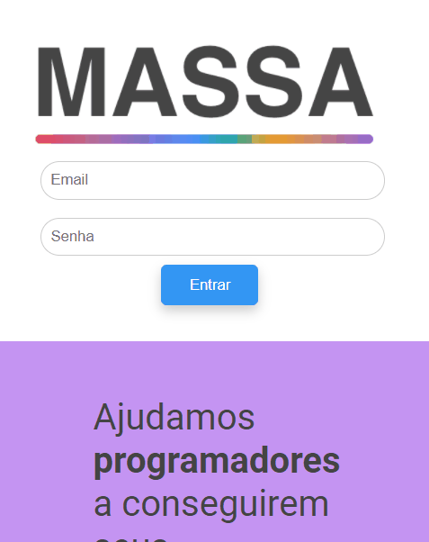

## Projeto Massa
### Projeto Massa, desenvolvido no curso de HTML e CSS GRID, consiste em um projeto fictício para simular uma plataforma em que tanto programadores quanto empresas podem se conectar, gerando assim um networking e até mesmo aquela contratação Massa !!!

###  👨‍💻 Desktop Version 

### 📱 Responsive to Mobile Version

## ✔ Technologies

- ✔ HTML
- ✔ CSS
